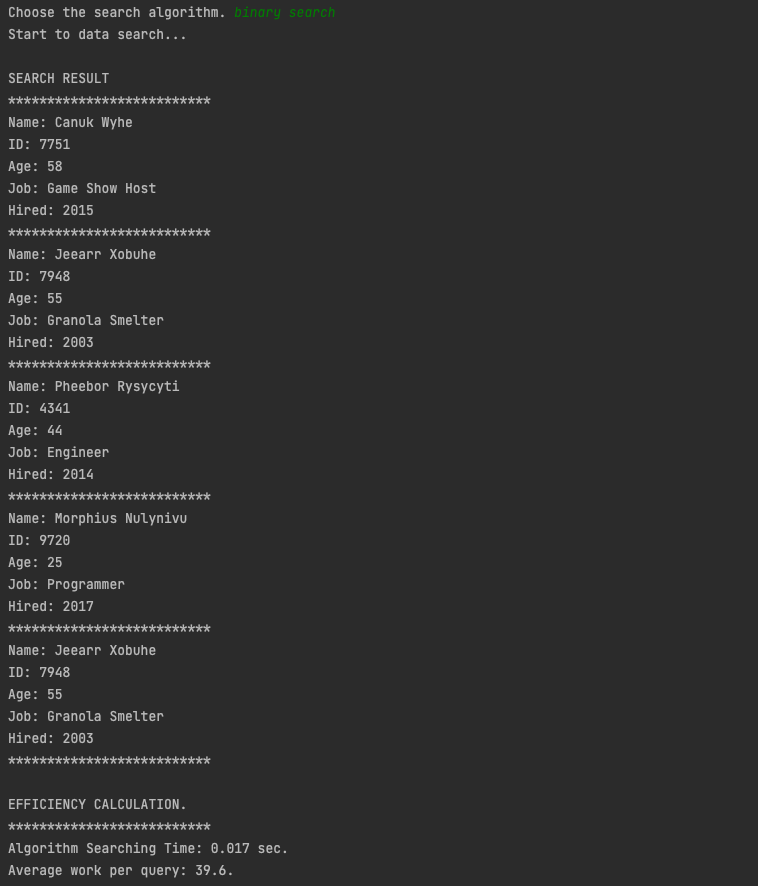

## Development Objective.

1. Implementing sorting and searching algorithm for the specific data.
    
    Implemented searching algorithms.
    
    - Binary Search
    - Sequential Search
    
    Implemented sorting algorithms.
    
    - Bubble Sort
    - Insertion Sort
    - Merge Sort
    - Selection Sort
    - Heap Sort
    1. Experiment with the efficiency of each searching and sorting algorithm.

---

## Result. 

1. Algorithm Implementation.
    - To implement the searching algorithms, I created methods for each searching algorithm.

- To use each sorting algorithm in the program, I created an interface to use as the outline of each sorting engine, so that each of the sorting engines implements the interface and Override abstract method in the interface.

1. Algorithm efficiency experiment.

To experiment with the algorithms I created a data file that has 10000 employee information.

[[Like of sample data File]](https://github.com/spencerkwon92/Algorithm_Implementation/blob/main/largeData.txt) 

Each line has employee data in order by:

                                              Name | Id | Age | Job | Hired Date

Among the data, I search the 5 employees by inputting the ID number to test the algorithm efficiency.

- Searching Algorithm Experiment.

I tested the searching engine with the binary search algorithm.

I tested the searching engine with the sequential search algorithm.

- Sorting Algorithm Experiment.

Bubble Sort.

Insertion Sort.

Selection Sort.

Merge Sort.

Heap Sort.

- Result.

By the comparison between those algorithms, I could know that heap sort is the fastest sorting algorithm among the 5 different ways of sorting algorithms. Also, I could define that the binary search has more efficiency than sequential search.
